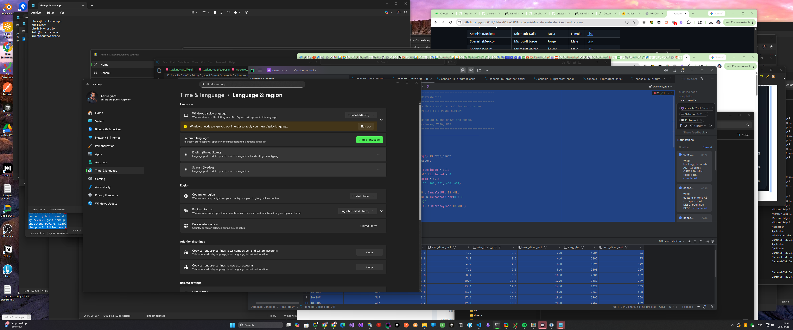

# LinguaLens

Ambient language learning overlay for Windows. Select text anywhere, press a hotkey, get instant translation + IPA pronunciation + natural TTS — all running locally on your GPU.

## How it works

1. Highlight text in any application
2. Press `Ctrl+Alt+L` (configurable)
3. A floating overlay shows: translation, IPA transcription, and speaks the text aloud
4. Overlay auto-dismisses after playback

All inference runs locally — no cloud APIs, no data leaves your machine.

## System Requirements

| Component | Minimum | Recommended |
|-----------|---------|-------------|
| OS | Windows 10 (22H2+) | Windows 11 |
| CPU | Any x64 | 8+ cores |
| RAM | 8 GB | 16 GB |
| GPU | None (CPU fallback) | NVIDIA RTX 20xx+ with 6GB+ VRAM |
| CUDA | Not required | CUDA 12+ drivers for GPU acceleration |
| Disk | ~50 MB (app) + 3 GB (models) | Same |
| Network | Required for first-run model download | Broadband (2.9 GB download) |

### What you get at each tier

| Tier | GPU | Translation | TTS | Speed |
|------|-----|------------|-----|-------|
| Full | NVIDIA CUDA | TranslateGemma 4B | Kokoro natural voice | Instant |
| DirectML | Any GPU | TranslateGemma (CPU) | Kokoro (GPU) | TTS fast, translation slower |
| CPU | None | TranslateGemma (CPU) | Kokoro (CPU) | Works, noticeably slower |
| Basic | None, no models | Dictionary only | System voices | Single-word lookups |

## Install

1. Download `LinguaLens_x.x.x_x64-setup.exe` from [Releases](../../releases/latest)
2. Run the installer (per-user, no admin required)
3. On first launch, models download automatically (~2.9 GB)

> Windows SmartScreen may warn on unsigned builds — click "More info" → "Run anyway".

## Features

- **Translation** — TranslateGemma 4B for 55 language pairs, dictionary fast-path for single words
- **TTS** — Kokoro 82M ONNX with GPU cascade (CUDA → DirectML → CPU), Web Speech API fallback
- **IPA** — espeak-ng phonemic transcription
- **Text capture** — UI Automation (clipboard-free) with clipboard simulation fallback
- **Settings** — language, voice, hotkey, theme, auto-play, replay speed, IPA toggle
- **History** — searchable translation history with SQLite

## Tech Stack

- **Tauri 2** + Rust backend — single binary, ~3 MB loader
- **llama-cpp-2** — TranslateGemma 4B GGUF inference
- **ort** (ONNX Runtime) — Kokoro TTS with CUDA/DirectML/CPU
- **espeak-ng** — IPA transcription + phonemization
- Vanilla JS frontend — no framework, ~1000 lines

## License

MIT
